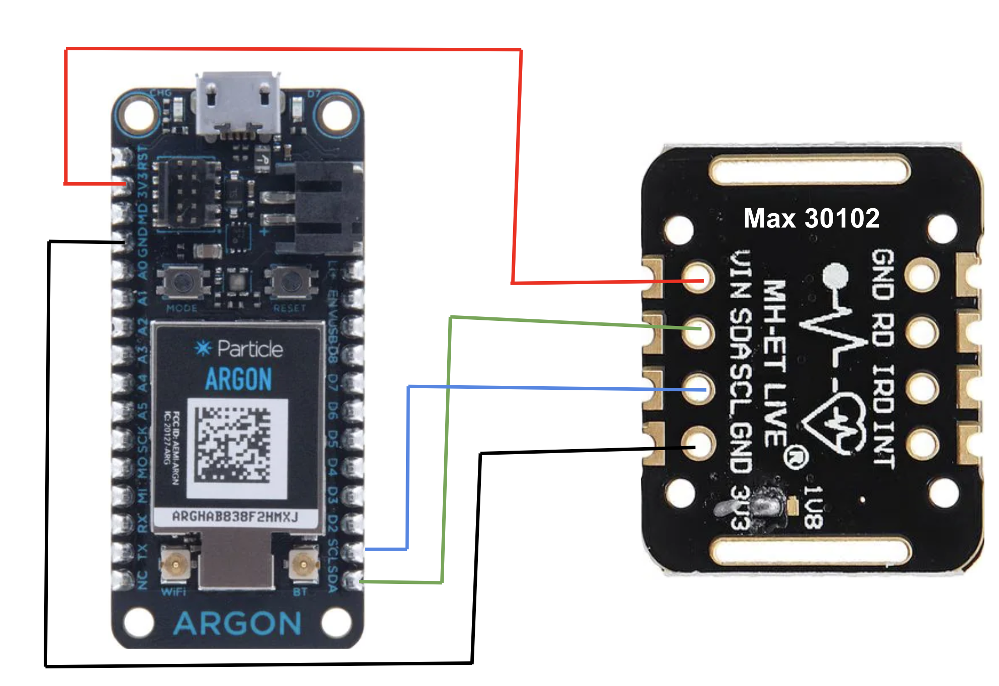

ECE413/513 Final Project (Particle MCU Side) - Team 3
======

[Please provide the main .ino and .cpp files, and related module code. Also, please provide a brief description.]

**Team members:**

- Todd Peterson
- Andres Galvez
- Eli Jacobson
- Tej Scott

Firmware
---------

### Modules
|Module|Description|
| :- | :- |
|[argon.ino]|Code that we developed as a team to read data from the heartrate sensor and then send it to our server at configurable intervals and time periods. This will automatically create the nessisary cpp file in VSCode using the Particle Workbench.|
|[MAX30105.cpp/.h](https://github.com/sparkfun/SparkFun_MAX3010x_Sensor_Library)|Library that we used to initalize and read the heart rate sesnor data|
|[Wire.h](https://docs.particle.io/reference/device-os/api/wire-i2c/)|Library we used to easily implement I2C comminication with out Max heart rate sensor device|
|...|...|

Hardware
---------

For hardware setting, please provide BOM list and Pin Assignment.

### BOM List and Pin Assignment
|Device|Spec.|Number|Pin Assignment|
| :- | :- | :- | :- |
|Particle Argon|Nordic Semiconductor nRF52840 SoC|1|SCL (I2C Clock), SDA (I2C Data), 3V3 (Power to Max device), GND (Ground to Max device), RGB light (Used to give information to the user based on color)|
|Heartrate Sensor|MAX30102|1|PIN1 (GND from Argon), PIN2 (SCL - I2C clock from Argon), PIN3 (SDA - I2C data to and from Argon), PIN4 (3V3 - Power to device from Argon) |
|...|...|...|...|

Please provide the circuit and hardware figure:  
